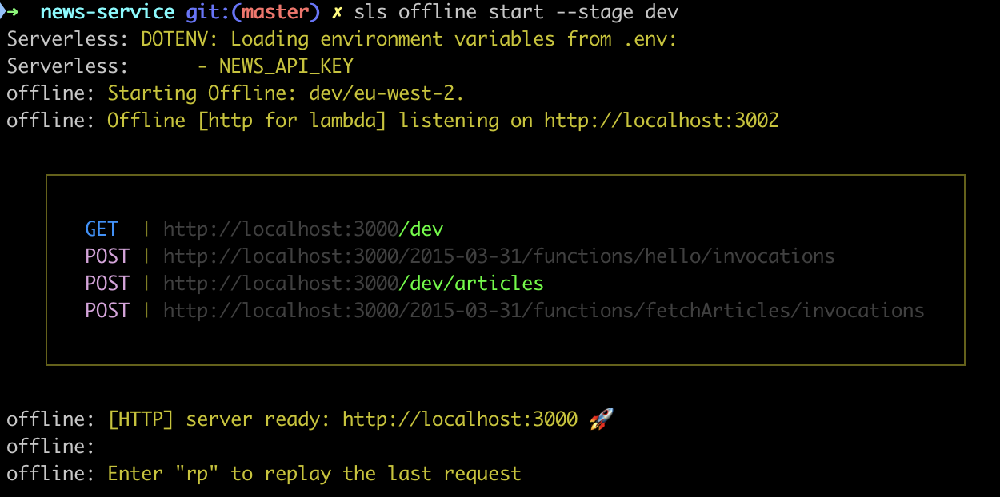

# Product Engineer Front-End Challenge

This challenge includes coding, an analytics design question, and a database evaluation task.

Whilst we are looking for a front-end focused developer, as a small team we are realistically sharing the load on all applications. So the final task is meant to assess how you think about data-intensive systems - it does not use any specific database technology.

For the coding & analytics design question, we have a basic News Reader: A pair of applications that serve up a front-end, written in [Vue.js](https://vuejs.org/), and a backend written in Node.js using the [Serverless Framework](https://serverless.com/). They allow a reader to see the latest UK news and search for articles by keywords.

For the database evaluation task, there are 3 questions are in the included [DB-Task.md](DB-Task.md) file, and they are centred on an event registration system.

**Please email us the link to your repository when it's ready to review, at least 48h before your interview. Thank you, and good luck! 🎉**

##  What is the Challenge?

Please fork the repository to begin the task. [Submission guidelines](#what-we-are-looking-for) are at the bottom of this page 😊

1] First, the code: After you have gotten familiar with the app, [technical details of the app are below](#main-app-functionality--file-structure), we would like for you to:
1. add a section to the homepage which allows the user to filter the results according to **ONE** category that a reader might want to filter news by (e.g. topic, source, date, or ??) 
2. add at least 1 or 2 tests to the front-end web app
3. implement web accessibility on components
4. *(optional tasks)* If you find that you have time and would like to make the front-end app even nicer, you could tackle one of the following tasks:
   - improve the functionality & design of the Article component (`src/components/Article.vue`) so that it is more intuitive to a reader
   - improve the overall design of the homepage
   - make the website SEO friendly
   
**If you prefer, you are welcome to use your own/preferred front-end framework (e.g. React)**, to ping our included backend service. You are also welcome to **make any changes to the codebase that you would like to, as long as it is still functional.** Please remember that this is meant to take up to **3 hours in total**, and is merely an exercise, so we are not expecting the entire moon, just holistic improvements! 😬 😅

2] Then, analytics design: create a markdown file describing what **types of user behaviour** you would like to capture on this page for an analytical framework (e.g. [Heap](https://docs.heap.io/docs), [Amplitude](https://developers.amplitude.com/docs) or [Mixpanel](https://developer.mixpanel.com/docs)), and **why**.

3] Finally, write include your answers to the **[Database Evaluation Task](DB-Task.md)** in your markdown file.

## Quickstart dev

Use the latest Node version as it's recommended.
On Mac, you can use [Homebrew] to get [nvm](https://github.com/nvm-sh/nvm) to manage your version & [`yarn`](https://classic.yarnpkg.com/en/docs/install/#mac-stable) or `npm` itself for packages, then:
- `nvm install node`
- `nvm use node`
For other OSes, the installation tools are in the links for `nvm` and `yarn` above. You are also welcome to use `npm` instead of `yarn`.

1. To run the backend service - written using the Serverless framework:
   1. If you haven't installed the serverless CLI tool, do so by using a package manager, like this: `npm install serverless -g`
   2. `cd news-service`
   3. set up your API key in the `.env` file `NEWS_API_KEY={{ your api key }}`
   4. `yarn install`
   5. Run `sls offline start --stage dev`
2. To run the front-end app - written in VueJS:
   1. `cd news-app`
   2. In `news-app` - `.env`:
        ```
        NODE_ENV=dev
        VUE_APP_SERVICE_URL=http://localhost:3000/
        VUE_APP_SERVICE_KEY={{ TBA API key for serverless when closer to deploy }}
        ```
   3. `yarn install`
   4. Run `yarn serve`

Once you are able to run the app following the steps [above](#quickstart-dev), it'll render the view on `http://localhost:8080/` like this: 
Your backend service will be running on `http://localhost:3000/` should look like this:


###  Main App Functionality & File Structure

The key dependencies used are the [`news-api` module](https://www.npmjs.com/package/newsapi) which allows us to fetch news from [NewsAPI.org](https://newsapi.org/) on our backend, [`axios`](https://www.npmjs.com/package/axios) & [Vuetify](https://vuetifyjs.com/en/) on front-end for fetching data and components respectively.

The main backend endpoint is the `/articles` endpoint, which can return the [top headlines](https://newsapi.org/docs/endpoints/top-headlines) or results based on a query of ["everything"](https://newsapi.org/docs/endpoints/everything). It is a POST request that takes the type (`headlines` or `search`), along with the query body (uses `country` for headlines, and `q` for the search).

The front-end pings the endpoint, loads the data accordingly and renders it for the reader on the homepage.

In `news-app` front-end: `App.vue` renders different views (in `src/views`) through the router, and pulls in data from the backend endpoint to load each into its own article component (`src/components/Article.vue`). The main view is `src/views/Home.vue`

In `news-service` backend: 
- `serverless.yml` defines how the endpoints will be declared for the provider, as well as doing some basic request validation / handling. Written in the context of an AWS Lambda service, as that can be easily deployed, basically free and is still scalable
- `handler.js` contains AWS-specific event handler logic
- `newsapi.js` contains "business" / user-focused logic 
- `test-data.js` is an optional local set for mocking the API & testing

Both apps have [Jest](https://jestjs.io/) set up for testing in `/tests`, and use ESLint & Prettier for code formatting. The front-end app has [Cypress](https://www.cypress.io/) set up for E2E, but no E2E tests have been written, so **you are allowed to use whatever testing framework you would like**.

### What we are looking for

These are the guidelines on what we are looking for in our submissions:
- Code is human-readable and easy to understand
- Code patterns correspond to expected user-facing functionality
- The accompanying file of markdown answers is well-structured and communicates your thoughts clearly and concisely
- Any tests that are written make sense according to how a user might behave on the page
- The styling of code is consistent and technical choices are well-commnunicated
- As a news reader, it is clear how I should can use the page to find news that I am looking for
- If technologies used are changed (e.g. using React instead of Vue), a set of instructions on how to run the app are updated in the README.
- Any changes to file structure are also communicated in the README

# Nick's changes

- I added a file called "Filters.vue" in news-app/src/components.
   - I created it so it's easy to add new filters, but the one I created filters articles by source.
- I took out my API key from the final version for security reasons.
- I added a couple tests, I didn't create any new files for these, just kept it in news-app/tests/unit/example.spec.js.
- I improved accessability on components by using the Vue Announcer and another Vue Router (I saw you guys already added one).
- I also made the site more SEO friendly by adding meta tags and changing the indexing to history mode instead of hash mode.
- I created a file called "analytics-design-suggestions.md".
- I added a UML diagram of the database flow and tables/fields called "Suvera_database.png".
